# Arizona State University CSE 205 - Visual Studio Code JavaFX template

This is github template is mean’t to help students in CSE205 at Arizona State University setup a non-modular JavaFX development environment in Visual Studio Code.

## **Requirements**

- [JavaFX SDK](https://gluonhq.com/products/javafx/)
  - MacOS for _Apple Silicon(x64) and Intel(aarch64)_
  - Windows for _x64 and x84_
  - Linux for _aarch64, arm32, and x64_
- [Java Profile](https://vscode.dev/profile/github/b3fa920f460128aaf090ee6df788cc23)(optional)
  - you can import the profile by use this url: `https://vscode.dev/profile/github/b3fa920f460128aaf090ee6df788cc23`
    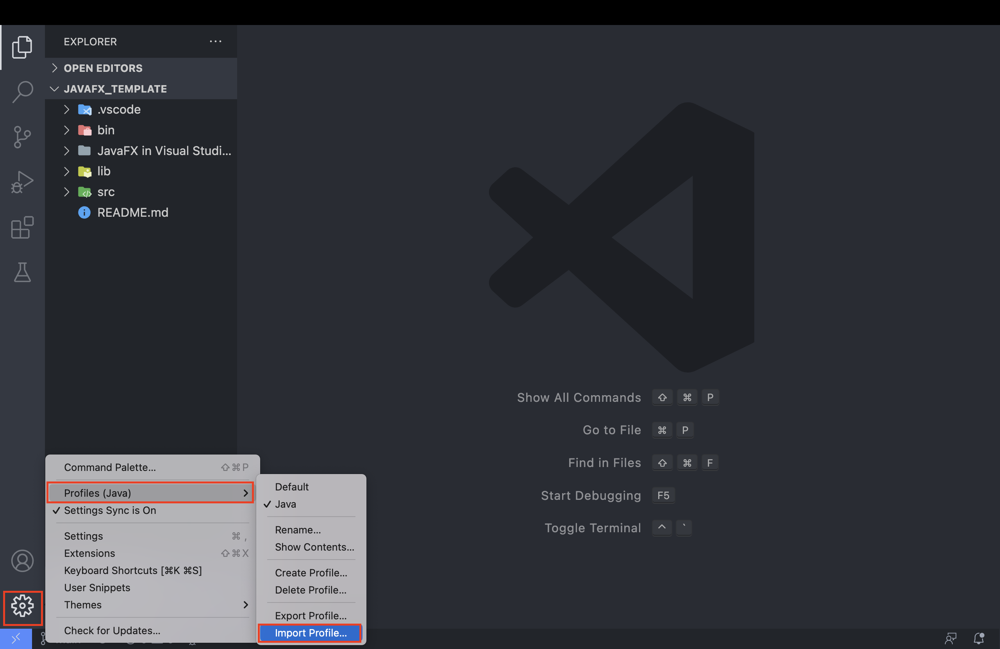
  - An optional download, but will have necessary extensions for CSE205 Java and JavaFX projects, along with some other helpful extensions I use to make development easier. If you decide you don’t want to download it. You’ll need to download the following extension for javaFX development:
    [**Extension Pack for Java**](https://marketplace.visualstudio.com/items?itemName=vscjava.vscode-java-pack)

## Setup

### 1.) **Create the Java project**

- open the command palette and enter `Java: Create Java project...`, then select it.
  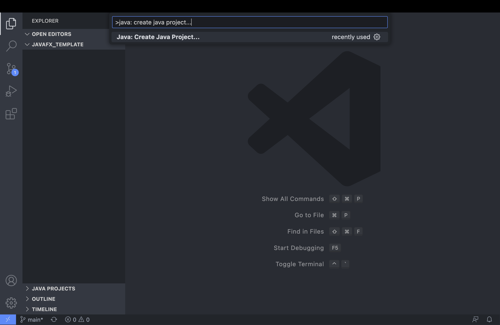
- select `No build tools` in the list as the project type.
  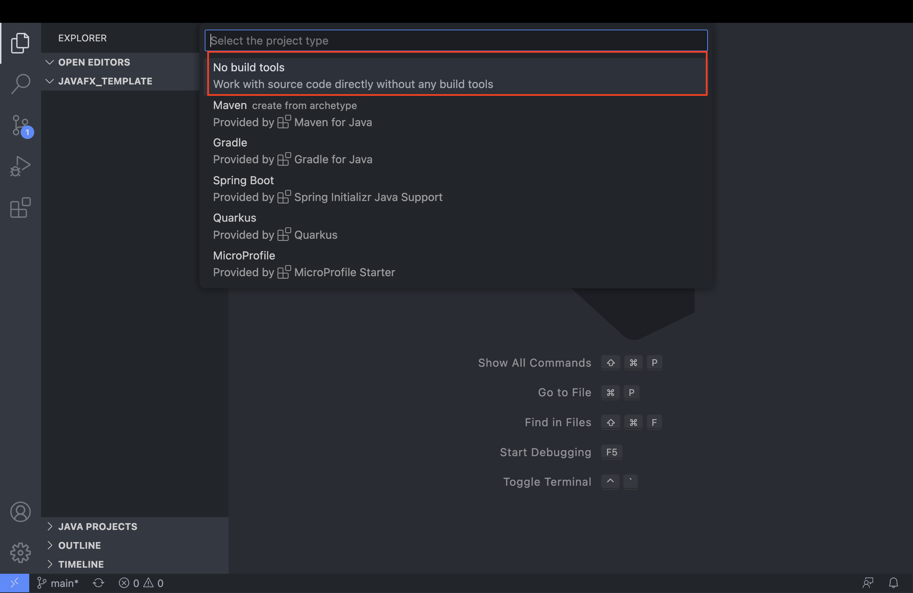
- Then name the project of the file(i.e `assignment_06`) and then select a target location where you want to store the new project.
  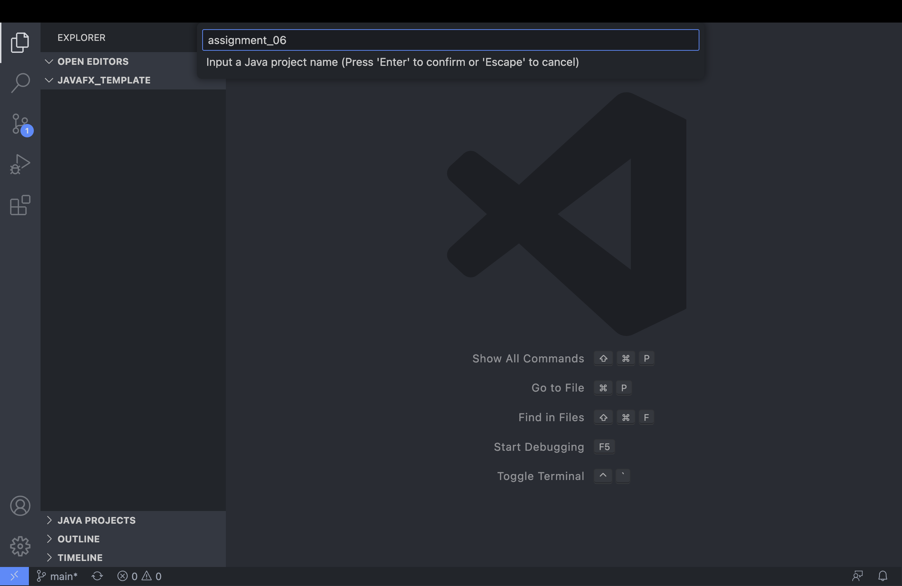
- From here, the newly created project will open in a new Visual Studio Code window.

### 2.) Add Java SDK library dependencies

- To add JavaFX as dependencies to your project, you can simply copy all the jar files from the lib folder of your downloaded JavaFX SDK, for instance `/Users/your-user/Downloads/javafx-sdk-19/lib/` to the lib folder of your project.
  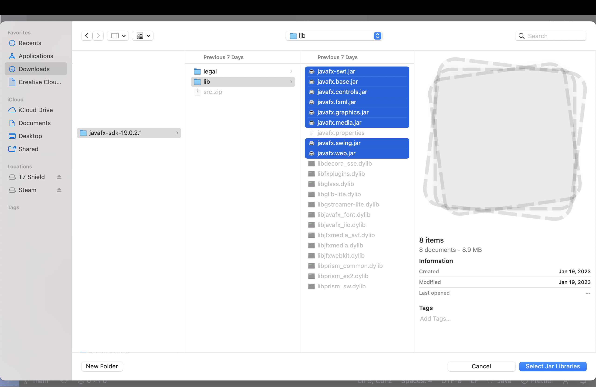
  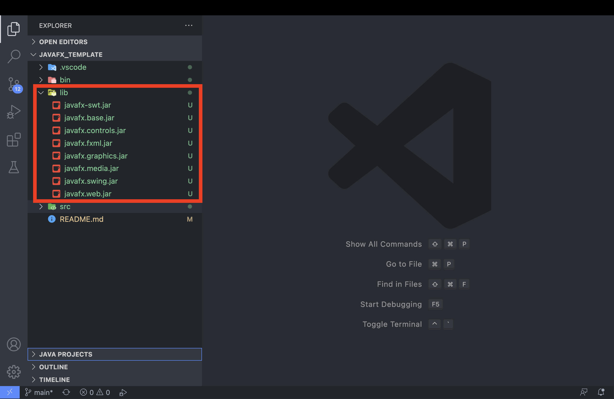
- Or alternatively, under `JAVA PROJECTS`, by the `Reference Libraries` click on the `+` sign and add the reference libraries needed for the project. In the 2 picture below, I’m adding all of the reference libraries in the Java SDK download.

  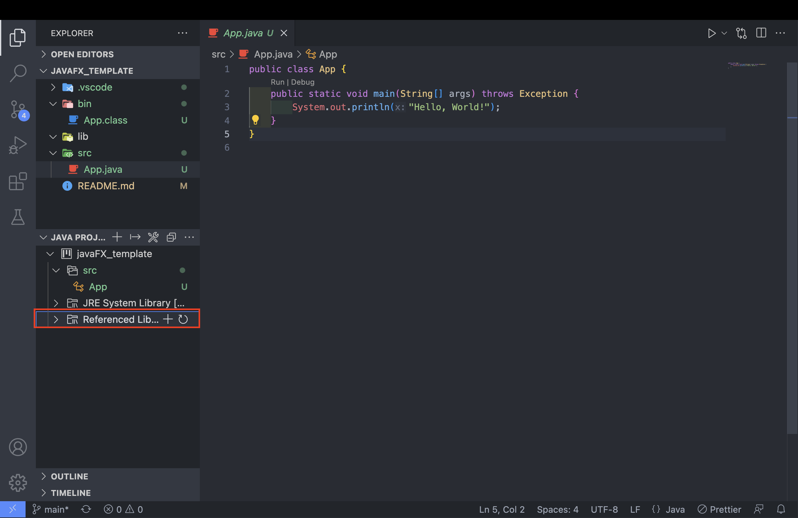

  

  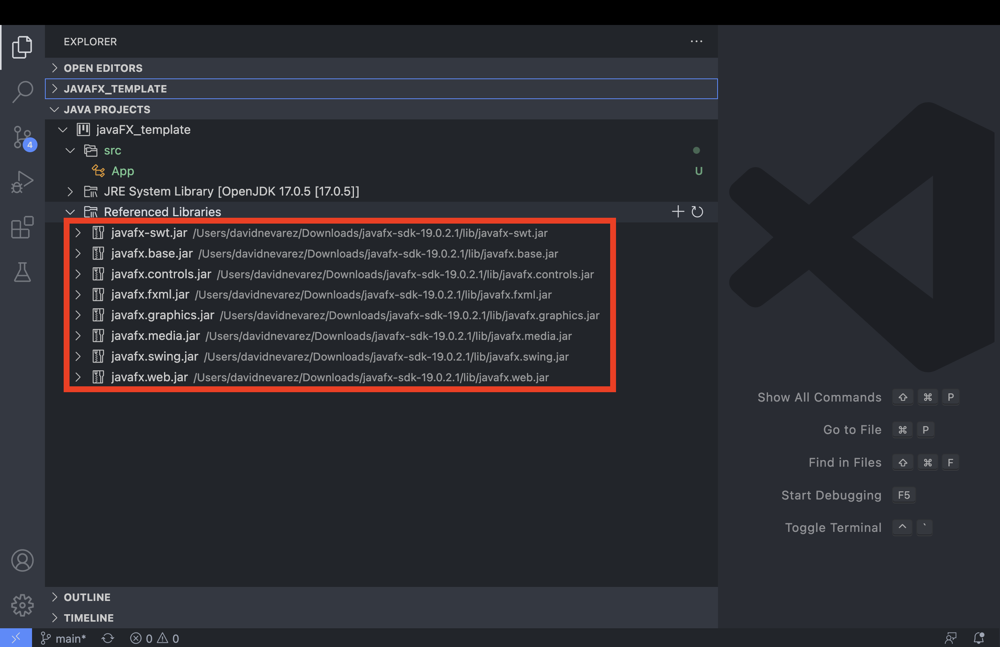

- you know if they downloaded correctly if you can see the file in `Reference Libraries` section under `JAVA PROJECTS`.

### 3.) Configue Java Runtime

- The last thing you got to do is ensure that your java runtime is running java 8 aka `java 1.8`

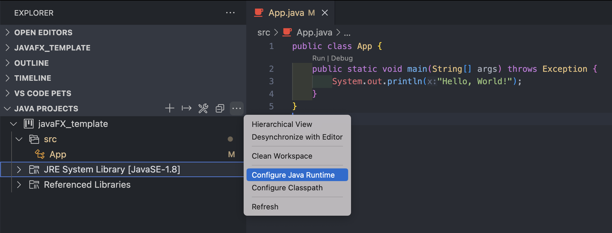

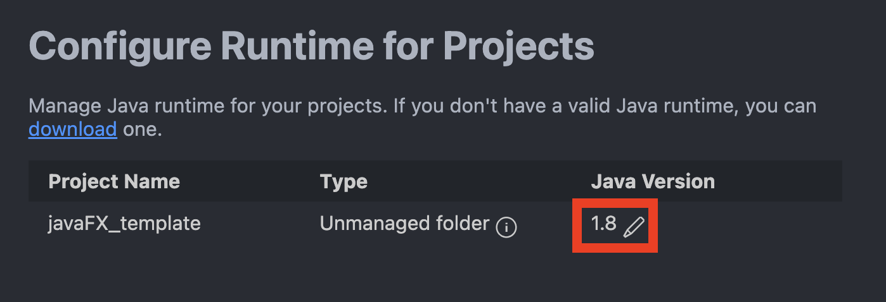

- If your java runtime isn’t running java verison `1.8`, chnage the verison to `1.8`

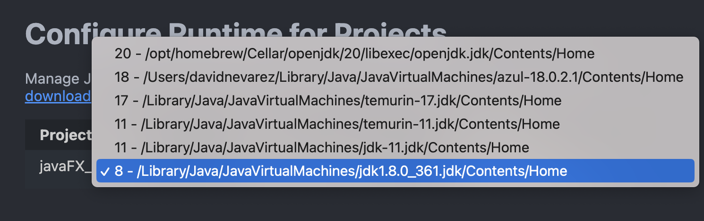

### 4.) From here, you have everything you need to make an JavaFX project in Visual Studio Code. Just make sure all you source files aka `.java` files are in `/src`
